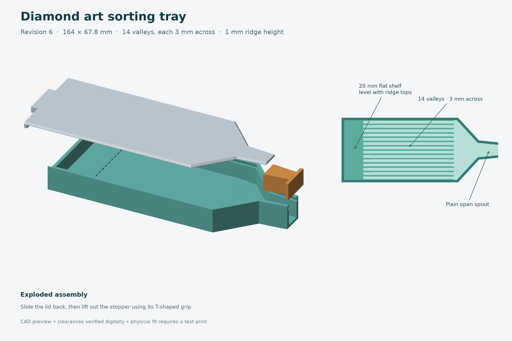

# 3D print sketches

A collection of printable designs, with source files, model exports, and notes for rebuilding them.

My daughter loves diamond art and asked me to design a sorting tray for her. That request started this collection and its first project, the diamond art tray.

## Projects

| Project | Description |
|---|---|
| [Diamond art tray](diamond-art-tray/README.md) | A sorting tray with 14 valleys, a flat rear shelf, a pouring spout with a tapered stopper, and a sliding lid. |

The current tray has 3 mm-wide valley bottoms and ridges that are 1 mm tall and 1.5 mm wide at the base. Its footprint is 164 × 67.8 mm.

Download the [revision 6 print pack](diamond-art-tray/diamond-art-tray-v6-print-pack.zip) for STL and model-only 3MF files to import into Bambu Studio. The [project README](diamond-art-tray/README.md) contains assembly instructions, fit-test parts, dimensions, and build commands.

The models pass digital geometry and clearance checks. Physical print fit and Bambu Studio slicing are still unverified.

Each design lives in its own subdirectory so its source, documentation, previews, and printable files stay together.
