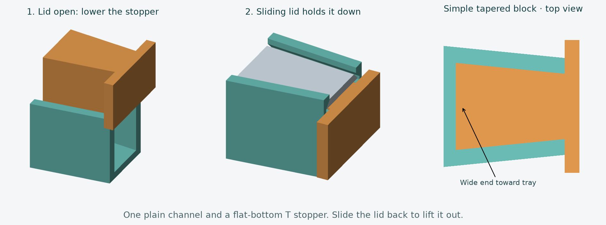

# Diamond art sorting tray — revision 7

My daughter loves diamond art and asked me to design this sorting tray for her. This project grew from that request, with adjustments to make the tray easier to print and use.

This version follows the **simpler stopper layout in your three reference photos**: a plain open spout that widens toward the tray, and a long tapered block with a wide T-shaped grip. The block rests on the spout floor, with its wide end toward the tray. Close the sliding lid to hold it down. There are no separate plug pockets or retaining slots.

The tray has **14 valleys with 3 mm-wide flat bottoms**, a narrower **164 × 67.8 mm** footprint, and a **20 mm flat rear shelf level with the ridge tops**. Each ridge is **1 mm tall above the floor and 1.5 mm wide at its base**, with **0.2 mm-radius rounded shoulders** and an approximately 0.16 mm-wide flat crest. The rounding cuts inward from the upper corners, preserving the original sloped sides and 3 mm flat valley bottoms. A **4 mm-long ramp** descends 1 mm from the edge of the full 20 mm flat rear shelf into the valleys. The reference photos guide the design rather than establish measured dimensions.

These changes aim to reduce snagging and help the drills tumble and settle flat-side down during gentle shaking. Their effect on sorting needs a physical print test. The tray footprint, sliding lid, spout, and stopper dimensions are unchanged; only the tray needs to be reprinted.

## Files for Bambu Studio

Extract **diamond-art-tray-v7-print-pack.zip**, then import these three parts separately at **100% scale, in millimeters**. Each is provided as STL and model-only 3MF. Choose only one format per part, and select your printer, nozzle, and filament in Bambu Studio.

| Part | File stem in print-files/ | Printed size (mm) |
|---|---|---|
| Tray | 01_tray | 164 × 67.8 × 17.4 |
| Sliding lid | 02_sliding_lid | 170.65 × 65.1 × 4.2 |
| T-shaped stopper | 03_spout_plug | 20.4 × 22 × 12.3 |

**Use the matching tray, lid, and stopper from revision 7.** The generic print-pack ZIP also contains revision 7.

Bambu Studio supports STL and 3MF files; see its [official documentation](https://github.com/bambulab/BambuStudio/wiki/Command-Line-Usage). The 3MFs contain geometry and millimeter units, with no printer or filament presets. Each part fits within a 180 mm build volume; Bambu's A1 mini has a [180 × 180 × 180 mm build volume](https://cdn1.bambulab.com/documentation/quick-start-f507128172bdf/Quick%20start%20guide%20-%20A1%20mini-EN.pdf). Print the tray and lid on separate plates if needed.

## Printing and assembly

Starting settings: **PLA, 0.4 mm nozzle, 0.20 mm layers, 3 wall loops, 4 top and bottom layers, 15% infill**. These are design-based starting settings; inspect your sliced preview before printing.

Keep the supplied orientations: tray floor down; lid broad outer face down with the rear grip above it; stopper **flat bottom down**. The stopper is one flat-bottom extrusion with no overhangs. The tray spout has no fixed roof, and the lid-track undersides slope about 45 degrees. Start with supports off.

Slide the lid back at least **22 mm** to uncover the stopper area. Lower the stopper into the open channel, with the wide end toward the tray and the T-shaped grip outside the mouth. It rests on the floor. Close the lid to hold it down. To remove it, slide the lid back and lift using the T grip. You can close the lid again after removing the stopper to pour through the spout.

The neck and stopper taper together in plan. The wide inner end prevents the stopper completely sliding out through the narrower mouth while the lid is closed. The T grip stops it moving inward. The sliding lid has a rear stop but no latch. Clearances allow a little movement; this is a cover for diamond-art drills.

## Small fit test first

Print these three files before committing to the full tray:

- print-files/optional/fit_test_spout: the 20 mm tapered spout section.
- print-files/optional/fit_test_spout_lid: the matching short lid.
- print-files/03_spout_plug: the actual T stopper.

Rest the stopper in the test spout, then slide the short lid in from the rear. Align the lid's rear edge with the test spout's rear edge; the lid stops 0.35 mm short of the mouth. Check that it holds the stopper down and that the stopper lifts out easily once uncovered. The short test lid has no travel stop, so position it manually.

If the stopper is tight, use optional/plug_relaxed_fit, which adds 0.15 mm of side clearance. The optional rear track and short rear lid tests are also available. Short tests cannot establish whether a full-length lid will warp.

## Validation and CAD

Verification.json records watertight meshes, consistent winding, one connected solid per part, positive volumes, STL and core-3MF round trips, and build-volume bounds for all eight parts. It verifies 14 valley bottoms at Z=1.8 mm and ridge/shelf tops at Z=2.8 mm, giving **1 mm ridge height above the floor**. A horizontal section just above the floor verifies **3 mm flat width for every valley** and **1.5 mm base width** for each of the 13 internal ridges. Row pitch is now **4.5 mm**. Fourteen valley flats plus thirteen full ridges and two half ridges use 63 mm of internal width; two 2.4 mm walls bring the total to **67.8 mm**. The lid clears the tray and seated stopper across 172 sampled removal positions. Both stopper versions lift vertically without tray collision when uncovered; the closed lid blocks a 0.5 mm lift, and the tapered channel blocks an 8 mm forward withdrawal. The same capture checks pass for the small fit fixture.

Additional geometry checks sample the shelf ramp at five positions in all 14 channels and probe both rounded shoulders of all 13 internal ridges. The checks confirm a continuous linear ramp and the intended fillet profile within 0.002 mm mesh approximation tolerance.

The stopper rests on the floor at Z=1.8 mm, with its top at Z=14.1 mm. The closed lid underside is Z=14.3 mm, giving **0.20 mm top clearance**. Nominal stopper side clearance is 0.20 mm per side. Lid track lower-edge clearance is approximately 0.35 mm per side and 0.30 mm below.

**Revision 7 has not been physically printed or sliced in Bambu Studio.** The fit test is the next check. OpenSCAD was unavailable for an independent render check.

Edit dimension constants in build_tray.py to change the model, then regenerate:

    python3 -m venv .venv
    .venv/bin/python -m pip install -r requirements.txt
    .venv/bin/python build_tray.py

The builder replaces revision-7 exports, previews, validation, generated OpenSCAD, and the current ZIP. Diamond-art-tray.scad is generated from the same CAD operations; select tray, lid, plug, assembly, or exploded with its part setting. Dimension changes are easiest in the Python source.
